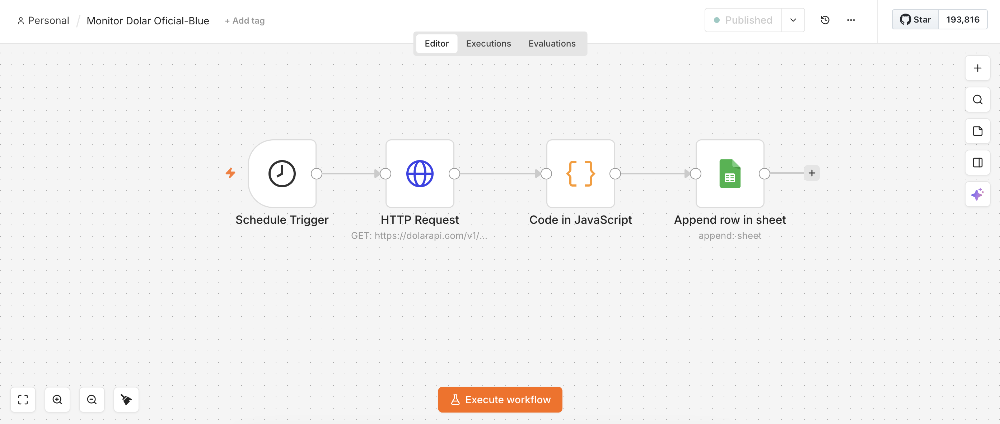

# n8n-dolar-monitor
Pipeline que registra automáticamente, dos veces por día, la cotización del dólar oficial y blue en Argentina. Calcula la brecha cambiaria y guarda el histórico en Google Sheets. Pensado como capa de datos para un dashboard en Power BI.

## Stack
- **n8n** (cloud) — orquestación del pipeline
- **DolarAPI** — fuente de datos, API pública sin autenticación
- **JavaScript** (Code node de n8n) — transformación y cálculo
- **Google Sheets** — almacenamiento del histórico

## Arquitectura
- Schedule Trigger (11:00 y 16:00, todos los días)
- HTTP Request: API pública de DolarAPI (https://dolarapi.com/v1/dolares)
- Code (JavaScript): filtra oficial y blue, calcula la brecha
- Google Sheets: Append row: hoja "Historico"

## Archivos en este repo
- `workflow.json` — export completo del workflow de n8n, importable directamente en cualquier instancia de n8n

## Por qué oficial y blue
De las 7 cotizaciones que expone la API utilizada (oficial, blue, bolsa, contado con liqui, mayorista, cripto, tarjeta) se eligieron específicamente **oficial** y **blue** porque representan los dos polos estructurales del mercado cambiario argentino: el tipo de cambio regulado por el Banco Central y el de mercado libre informal. 

La diferencia entre ambos —la brecha cambiaria— es un indicador económico reconocido, utilizado en análisis de riesgo país y expectativas de mercado. Las demás cotizaciones (bolsa, CCL, mayorista, cripto, tarjeta) son variantes intermedias o de nicho que no aportan un segundo polo conceptual al análisis.

## Estado del proyecto y próximos pasos
- [x] Pipeline diario funcionando en producción (n8n)
- [x] Histórico acumulándose automáticamente en Google Sheets
- [ ] Dashboard en Power BI con vista semanal y mensual, conectado al histórico
- [ ] Refresh automático del dashboard (Power BI Service, scheduled refresh)
- [ ] Suscripción por mail con captura semanal del dashboard (función nativa de Power BI Service)
